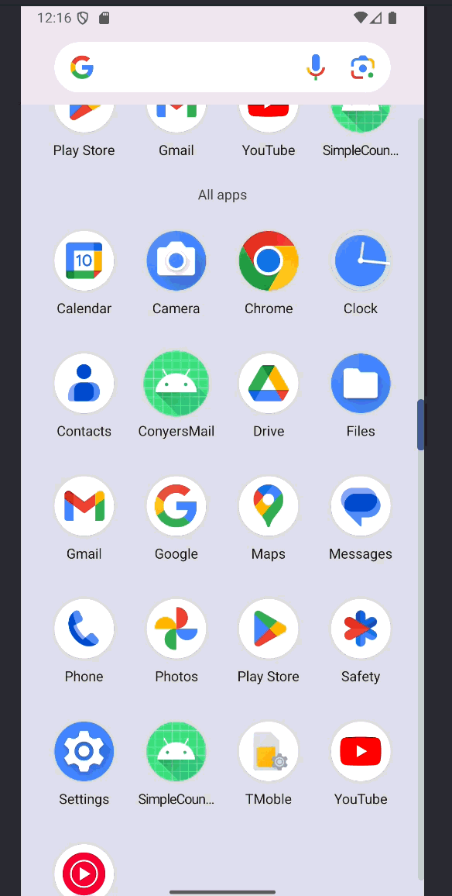

# Android Application - *ConyersMail*

Submitted by: **Malikai Conyers**

**ConyersMail** is an android app that shows a list of mock emails, which includes, the title, the subject, and the body of the actual email

Time spent: **6** hours spent in total

## Required Features

The following **required** functionality is completed:

* [ ] User can scroll through a list of 10 emails
* [ ] Email contains a title
* [ ] Email contains a subject and body of text

The following **optional** features are implemented:

* [ ] List anything else that you can get done to improve the app functionality!

## Video Walkthrough

Here's a walkthrough of implemented features:

<!-- Replace this with whatever GIF tool you used! -->
GIF created with Snipping Tool
<!-- Recommended tools:
[Kap](https://getkap.co/) for macOS
[ScreenToGif](https://www.screentogif.com/) for Windows
[peek](https://github.com/phw/peek) for Linux. -->

## Notes

Constantly trying to find the reason why the crashed
Couln't figure out why emulator wasn't loading
Struggling on figuring out exactly how RecyclerView functions
Having to change the ID constantly so that the app would consistently load
Files taking a while to commit to GitHub in general, probably an Android Studio Error

## License

    Copyright [yyyy] [name of copyright owner]

    Licensed under the Apache License, Version 2.0 (the "License");
    you may not use this file except in compliance with the License.
    You may obtain a copy of the License at

        http://www.apache.org/licenses/LICENSE-2.0

    Unless required by applicable law or agreed to in writing, software
    distributed under the License is distributed on an "AS IS" BASIS,
    WITHOUT WARRANTIES OR CONDITIONS OF ANY KIND, either express or implied.
    See the License for the specific language governing permissions and
    limitations under the License.
